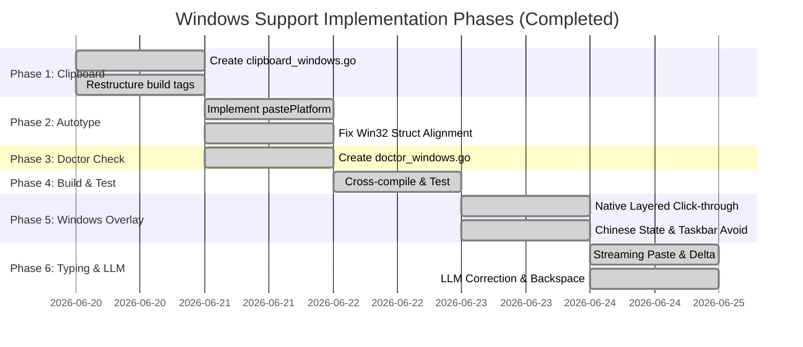

# Windows Support Implementation Plan

This document outlines the design and implementation plan to add native Windows support to **Just Talk**, enabling users to use global voice input directly in command-line environments like **PowerShell** and **CMD**, as well as other Windows GUI applications.

---

## 1. Technical Architecture & API Choices

Since Just Talk is written in Go, we can call native Windows APIs using Go's `syscall` package and the standard `golang.org/x/sys/windows` package. This allows us to implement Windows support **without requiring CGO**, meaning it can be built and cross-compiled easily on macOS or Linux using `CGO_ENABLED=0 GOOS=windows GOARCH=amd64`.

```mermaid
graph TD
    subgraph Windows OS Native APIs (No CGO)
        U32[user32.dll]
        K32[kernel32.dll]
        G32[gdi32.dll]
    end
    
    subgraph Just Talk Subsystems
        HK[hotkey: WH_KEYBOARD_LL Hook]
        CB[clipboard: OpenClipboard / SetClipboardData]
        AT[autotype: SendInput Ctrl+V / Backspace]
        REC[voice: Subprocess arecord/ffmpeg/sox]
        DOC[doctor: check ffmpeg/sox in PATH]
        OV[overlay: Layered Window & GDI Text]
        COR[correction: Doubao LLM API via HTTP]
    end

    U32 -->|Keyboard Messages| HK
    U32 -->|Clipboard Manipulation| CB
    U32 -->|Inject Key/Backspace Events| AT
    DOC -->|Verify Executables| REC
    U32 & G32 -->|Draw Translucent UI| OV
    COR -->|Optimize Text & Delete Stream| AT
```

### 1.1 Global Hotkeys
- **API Choice**: Windows Low-Level Keyboard Hook (`WH_KEYBOARD_LL`) via `SetWindowsHookExW` and `GetMessageW` message pump.
- **Current State**: [provider_windows.go](file:///Users/zfwei/AI/ai-tool/just-talk-go/hotkey/provider_windows.go) is implemented and uses `golang.org/x/sys/windows` to intercept keystrokes globally. Added high-performance debounce and repeat filtering.

### 1.2 Clipboard Access
- **API Choice**: Native Win32 Clipboard APIs (`user32.dll` and `kernel32.dll`).
  - Write: `OpenClipboard`, `EmptyClipboard`, `GlobalAlloc`, `GlobalLock`, write UTF-16 text (`CF_UNICODETEXT`), `GlobalUnlock`, `SetClipboardData`, `CloseClipboard`.
  - Read: `OpenClipboard`, `GetClipboardData` (`CF_UNICODETEXT`), `GlobalLock`, read string, `GlobalUnlock`, `CloseClipboard`.
- **Current State**: Native implementation created in [clipboard_windows.go](file:///Users/zfwei/AI/ai-tool/just-talk-go/internal/clipboard/clipboard_windows.go).

### 1.3 Auto-Submit / Simulation Paste (上屏)与退格控制
- **API Choice**: Win32 `SendInput` API simulating `Ctrl + V` and `Backspace` sequences.
- **Current State**: [autotype_windows.go](file:///Users/zfwei/AI/ai-tool/just-talk-go/internal/autotype/autotype_windows.go) corrected alignment with a padded 40-byte `INPUT` struct for x64 architecture, and added native bulk Backspace key-injection capability.

### 1.4 Audio Recording
- **Choice**: Execute external recording command `ffmpeg` or `sox` via standard pipes.
- **Current State**: [recorder_windows.go](file:///Users/zfwei/AI/ai-tool/just-talk-go/plugins/voice/recorder_windows.go) is implemented and supports DirectShow `ffmpeg` or WaveAudio `sox`.

### 1.5 Environment Checking (Doctor Check)
- **Choice**: Check if `ffmpeg` or `sox` is installed on PATH.
- **Current State**: Native implementation in [doctor_windows.go](file:///Users/zfwei/AI/ai-tool/just-talk-go/internal/doctor/doctor_windows.go) that tests execution of recording utilities.

### 1.6 Native Status Overlay (胶囊悬浮窗)
- **Choice**: Native layered click-through window (`WS_EX_LAYERED | WS_EX_TRANSPARENT | WS_EX_TOPMOST | WS_EX_TOOLWINDOW`).
- **APIs**: `CreateWindowExW`, `SetLayeredWindowAttributes`, `GetTextExtentPoint32W` (for text size centering), `CreateSolidBrush` (for background brushing), `SPI_GETWORKAREA` (for taskbar height/position detection).
- **Current State**: Implemented in [backend_windows.go](file:///Users/zfwei/AI/ai-tool/just-talk-go/plugins/overlay/backend_windows.go) using a separate message pump thread.

### 1.7 Speech Correction (火山大模型优化)
- **Choice**: Volcano Engine Ark API endpoint calls via standard HTTP POST request.
- **Flow**: Computes raw ASR text, activates the `optimizing` state on the overlay, deletes raw typed stream characters via bulk backspaces, submits raw text to the Doubao LLM API, and pastes the optimized return string.
- **Current State**: Implemented in [voice.go](file:///Users/zfwei/AI/ai-tool/just-talk-go/plugins/voice/voice.go).

---

## 2. Implementation Steps & Completion Status

All implementation phases are completed:



### Phase 1: Native Windows Clipboard (Completed)
1. Excluded `windows` from `clipboard_cmd.go` tags.
2. Implemented native Win32 clipboard functions in `clipboard_windows.go`.

### Phase 2: Auto-Type / Paste & Struct Alignment Fix (Completed)
1. Implemented `pastePlatform` using native Win32 clipboard and `SendInput` simulation in `autotype_windows.go`.
2. **x64 Alignment Fix**: Repadded the keyboard hook and SendInput structural layout (padding `keyboardInput` and `INPUT` structs to 40 bytes) to prevent silent injection failures on x64 architectures.

### Phase 3: Windows Doctor Environment Check (Completed)
1. Implemented PATH verification for `ffmpeg.exe` / `sox.exe` and listed available microphones in `doctor_windows.go`.

### Phase 4: Compilation and Verification (Completed)
1. Verified non-CGO cross-compilation:
   ```bash
   CGO_ENABLED=0 GOOS=windows GOARCH=amd64 go build -o build/just-talk.exe ./cmd/just-talk
   ```

### Phase 5: Native Status Overlay Window (Completed)
1. Developed a native borderless, transparent, topmost window with glassmorphic semi-translucent dark style using user32/gdi32 calls.
2. Programmed coordinate layout to query desktop area using `SPI_GETWORKAREA` to keep the overlay above the taskbar.
3. Added status text centering using `GetTextExtentPoint32W`.
4. Translated all status states to Chinese (`连接中`, `录音中`, `优化中`, `出错了`).
5. Configured runtime toggle behavior: overlays are disposed immediately if `enabled = false` in the configuration file and re-initialized when changed back to `true`.

### Phase 6: Real-time Streaming & LLM Correction (Completed)
1. Implemented incremental delta text typing via `SendInput` during recording.
2. Programmed simulated bulk `Backspace` key strokes to undo the streamed text upon completion.
3. Integrated Volcengine Ark Doubao LLM endpoint request with configurable URL, key, endpoint ID, temperature (default 0.1), and token count.

---

## 3. Interaction Workflow

With the newly completed subsystems, the user interaction loop is optimized:
1. **Startup**: Run `just-talk.exe --no-tui` or standard bubble tea TUI.
2. **Focus**: User highlights a text area.
3. **Trigger**: User hits the global hotkey (`Alt+Win`).
   - The native overlay displays `连接中...` then `录音中...` with a green indicator dot.
4. **Speaking**: As ASR processes audio, newly recognized tokens are appended incrementally in real-time.
5. **Stop**: User toggles the hotkey or lets go.
   - Overlay transitions to `优化中...` (blue indicator dot).
   - `autotype.Backspace` is dispatched for the length of the incremental text.
   - Raw transcription is submitted to the Doubao LLM API.
6. **Result**: The cleaned, corrected text replaces the draft, and copy-paste completes.

---

## 4. Future Planning: Status Capsule Dragging Design (Deferred)

The dragging feature for the Windows status capsule overlay is designed and documented below for future implementation.

### 4.1 Challenge: Window Click-Through Conflict
Currently, the status capsule overlay window is created with `WS_EX_TRANSPARENT` to enable mouse clicks to pass through it to the applications underneath. A transparent window cannot receive native mouse hover, down, or drag events.

### 4.2 Proposed Solutions
1. **Option A: Config-Driven Drag Mode**
   - Introduce `[overlay] draggable = true` in `config.toml`.
   - When `draggable = true`, remove the `WS_EX_TRANSPARENT` style at window creation.
   - The window behaves as a normal mouse-interactive window. After the user finishes dragging, they set it back to `false` in config.
2. **Option B: Shortcut-Modifier-Driven Toggle (Recommended)**
   - Keep `WS_EX_TRANSPARENT` active by default for click-through.
   - Run a low-level keyboard hook or monitor keyboard modifier state (e.g. holding `Shift` or `Ctrl`).
   - When the modifier key is held down, dynamically use Win32 `SetWindowLongPtr` to clear `WS_EX_TRANSPARENT` so the window becomes interactive.
   - When the modifier key is released, restore `WS_EX_TRANSPARENT`.

### 4.3 Win32 Event & Position Save Pipeline
1. **Simplified Dragging via WndProc**:
   - Inside the overlay window's `WndProc` function, capture the `WM_NCHITTEST` message.
   - Return `HTCAPTION` directly, instructing Windows to treat the client area as a title bar. This enables OS-native drag movement automatically without coordinate calculations.
2. **Position Capture and Saving**:
   - Catch the `WM_EXITSIZEMOVE` message, which signals that the user has stopped dragging the window.
   - Call `GetWindowRect` to query the new absolute position.
   - Persist the new coordinates under `[overlay].x` and `[overlay].y` in `config.toml` so the user's custom position is preserved on subsequent launches.


