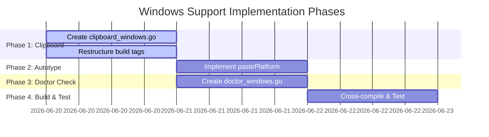

# Windows Support Implementation Plan

This document outlines the design and implementation plan to add native Windows support to **Just Talk**, enabling users to use global voice input directly in command-line environments like **PowerShell** and **CMD**, as well as other Windows GUI applications.

---

## 1. Technical Architecture & API Choices

Since Just Talk is written in Go, we can call native Windows APIs using Go's `syscall` package and the standard `golang.org/x/sys/windows` package. This allows us to implement Windows support **without requiring CGO**, meaning it can be built and cross-compiled easily on macOS or Linux using `CGO_ENABLED=0 GOOS=windows GOARCH=amd64`.

```mermaid
graph TD
    subgraph Windows OS Native APIs (No CGO)
        U32[user32.dll]
        K32[kernel32.dll]
    end
    
    subgraph Just Talk Subsystems
        HK[hotkey: WH_KEYBOARD_LL Hook]
        CB[clipboard: OpenClipboard / SetClipboardData]
        AT[autotype: SendInput Ctrl+V]
        REC[voice: Subprocess arecord/ffmpeg/sox]
        DOC[doctor: check ffmpeg/sox in PATH]
    end

    U32 -->|Keyboard Messages| HK
    U32 -->|Clipboard Manipulation| CB
    U32 -->|Inject Key Events| AT
    DOC -->|Verify Executables| REC
```

### 1.1 Global Hotkeys
- **API Choice**: Windows Low-Level Keyboard Hook (`WH_KEYBOARD_LL`) via `SetWindowsHookExW` and `GetMessageW` message pump.
- **Current State**: [provider_windows.go](file:///Users/zfwei/AI/ai-tool/just-talk-go/hotkey/provider_windows.go) is already implemented and uses `golang.org/x/sys/windows` to intercept keystrokes globally. No changes needed.

### 1.2 Clipboard Access
- **API Choice**: Native Win32 Clipboard APIs (`user32.dll` and `kernel32.dll`).
  - Write: `OpenClipboard`, `EmptyClipboard`, `GlobalAlloc`, `GlobalLock`, write UTF-16 text (`CF_UNICODETEXT`), `GlobalUnlock`, `SetClipboardData`, `CloseClipboard`.
  - Read: `OpenClipboard`, `GetClipboardData` (`CF_UNICODETEXT`), `GlobalLock`, read string, `GlobalUnlock`, `CloseClipboard`.
- **Action**: Create [clipboard_windows.go](file:///Users/zfwei/AI/ai-tool/just-talk-go/internal/clipboard/clipboard_windows.go) to avoid cross-platform command tool dependencies.

### 1.3 Auto-Submit / Simulation Paste (上屏)
- **API Choice**: Win32 `SendInput` API to simulate `Ctrl + V`.
- **Current State**: [autotype_windows.go](file:///Users/zfwei/AI/ai-tool/just-talk-go/internal/autotype/autotype_windows.go) has a working `simulatePaste()` function, but `pastePlatform` is stubbed out and returns an error.
- **Action**: Modify `pastePlatform` to copy text to the clipboard and then call `simulatePaste()`.

### 1.4 Audio Recording
- **Choice**: Execute external recording command `ffmpeg` or `sox` via standard pipes.
- **Current State**: [recorder_windows.go](file:///Users/zfwei/AI/ai-tool/just-talk-go/plugins/voice/recorder_windows.go) is implemented and picks `ffmpeg` (via DirectShow audio) or `sox` (via waveaudio).
- **Action**: Test configuration and integrate with doctor checks.

### 1.5 Environment Checking (Doctor Check)
- **Choice**: Check if `ffmpeg` or `sox` is installed on PATH.
- **Action**: Replace `doctor_other.go` with [doctor_windows.go](file:///Users/zfwei/AI/ai-tool/just-talk-go/internal/doctor/doctor_windows.go) to perform Windows-specific path verifications and return action-oriented advice (e.g. `winget install Gnu.FFmpeg`).

---

## 2. Implementation Steps

The implementation is structured into 4 sequential phases:



### Phase 1: Native Windows Clipboard
1. Exclude `windows` from [clipboard_cmd.go](file:///Users/zfwei/AI/ai-tool/just-talk-go/internal/clipboard/clipboard_cmd.go) tags (make it `//go:build linux`).
2. Create [clipboard_windows.go](file:///Users/zfwei/AI/ai-tool/just-talk-go/internal/clipboard/clipboard_windows.go) implementing native Win32 clipboard functions.

### Phase 2: Auto-Type / Paste
1. Update [autotype_windows.go](file:///Users/zfwei/AI/ai-tool/just-talk-go/internal/autotype/autotype_windows.go): implement `pastePlatform` using the native clipboard library and existing `simulatePaste()`.

### Phase 3: Windows Doctor Environment Check
1. Create [doctor_windows.go](file:///Users/zfwei/AI/ai-tool/just-talk-go/internal/doctor/doctor_windows.go) and implement `runPlatform`.
2. Check for `ffmpeg` or `sox` using `exec.LookPath`. If missing, output a required issue directing the user to run:
   ```cmd
   winget install Gnu.FFmpeg
   ```

### Phase 4: Compilation and Verification
1. Add build tags or compile test configurations.
2. Verify cross-compilation:
   ```bash
   CGO_ENABLED=0 GOOS=windows GOARCH=amd64 go build -o build/just-talk.exe ./cmd/just-talk
   ```

---

## 3. Interaction in PowerShell / CMD

Since `just-talk.exe` will hook global keys via low-level hooks, the workflow when running in **PowerShell / CMD** is:
1. User runs `just-talk.exe` (either in Bubble Tea TUI or daemon mode using `just-talk.exe --no-tui`).
2. User focuses their cursor in PowerShell/CMD or any Windows text input.
3. User presses the global hotkey (e.g. `Alt+Super`), speaks, and releases the hotkey.
4. The tool streams the recording to ByteDance OpenSpeech ASR.
5. The tool gets the text, copies it to the clipboard, and calls `SendInput` simulating `Ctrl+V`.
6. Since CMD and PowerShell natively accept standard paste input (`Ctrl+V` is standard on modern Windows Terminal / CMD), the text is typed directly into the command prompt.
